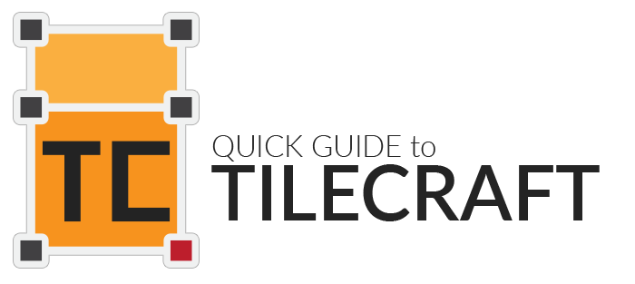
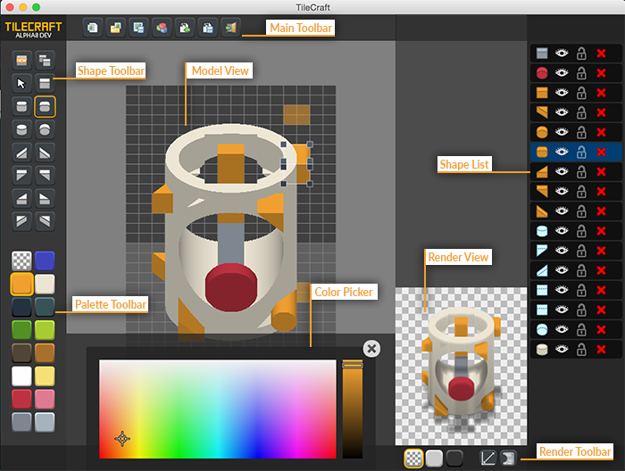
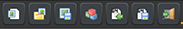
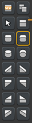
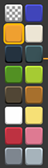
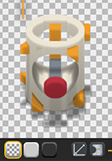
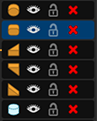
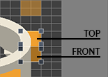
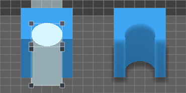

## Index

- [The interface](#interface)
- [What are the hole shapes?](#hole)
- [Export the model](#export)

---

# Interface

## Main toolbar

There are few buttons on the main toolbar, here's the explanation as they appear in the toolbar:

- **New model**:
Close the current model and start over with a new empty model

- **Open model**:
Open a model from a PNG file (see [Model Format](#export))

*Note* On Mac and Linux the dialog box does not work and you have to put a path by hand. I hope *systools* will be fixed soon. [OpenFL Issue #602](https://github.com/openfl/openfl/issues/602)

- **Save model**
Save/export the model to a PNG file (see [Model Format](#export))

*Note* On Linux the dialog box does not work and you have to put a path by hand. I hope *systools* will be fixed soon. [systools Issue #27](https://github.com/waneck/systools/issues/27)

- **Render model**:
Update the "render view" (same as clicking on the render view picture)

- **Import Base64 model**:
Load a model from a Base64 string (compatible with LGModeler)

- **Export Base64 model**:
Give a Base64 string easy to share with other people

- **Quit**:
I think you know what it means

## Shape toolbar

There are few buttons on the shape toolbar, here's the explanation as they appear in the toolbar:

- **New shape**:
Create a new shape a select it.

*Note:* If no shape is selected you can choose which color (from the color toolbar) and which shape type (from this toolbar) you want the new shape to be before clicking this button.

- **Clone selected shape**:
Clone the selected shape. The new shape will be an exact copy of the shape selected when clicking this button.

- **Pointer**:
Clicking here will set no selection.

- **All the shapes primitives**:
If a shape is selected clicking here will change the shape primitive.

When a shape is selected the corresponding primitive will be shown here (a little orange outline)

If no shape is selected you can choose which shape primitive you want to create a new shape.

## Palette toolbar

- If a shape is selected clicking here will change the shape color index.

- When a shape is selected the corresponding color index will be shown here (a little orange outline)

- If no shape is selected you can choose which color index you want to create a new shape.

*Note:* The first button represent the HOLE color. (see [Hole shapes](#hole))

## Color picker

Double clicking on a color button in the palette will open the color picker.

Here you can change the color of the selected index in the palette.

All the shape with that color index will change color as well.

## Render view

Here you can see the final image rendered from the model.

- On the render toolbar you can choose a background preview (transparent, black or white).

This *WILL NOT* be drawn on the exported PNG.

- You can also choose what size you want the export.

(This *WILL* determine the PNG size)
- Finally you can choose if you want an outline on the rendered image

(This *WILL* be in the PNG)

## Shape list

Here you can see all the shape in the model.

- You can make a shape invisible or to lock it if you don't want to mess its position on the Model View.

- You can also delete a shape from here from the big red X button (quite original if I have to say).

- Clicking on the shape in this list will select the shape on the Model View.

- Finally you can drag a shape in this list to change its order.

If two shapes occupy the same plane (Y or Z) the top one will be shown.

All the shapes below a Hole Shape will be cut by the Hole Shape, but not the ones above. (you can make a Hole Shape setting a shape color to the first "transparent" color in the toolbar)

## Model view

Finally, here's where the real magic happen.

- Clicking on the Model view will select the shape you are clicking on.

- Clicking on an empty space will deselect.

- When a shape is selected you can change its size dragging the 8 handles you will see around it.

- The 4 handles on the top change the XY plane size, the 4 ones on the front will change the XZ plane size.

- Also, dragging from the top rectangle of the shape will move the shape on the XY plane, and dragging from the front rectangle will move it on the XZ plane.

---

# Hole

An hole shape is a standard shape with a special property determine by its "color".

The "hole color" is the first one in the palette.

When a shape is an hole shape it will cut holes in every shape below it in the shape list.

This way you can make a lot more complex shapes than the basic primitives given by this tool.

---

# Export

TileCraft save its model as PNG files. So basically saving a model and exporting it for your needs it is the same action.

Inside the PNG TileCraft writes a private chunk (ID `tcMa`) with the model data inside.

This way you can share your model with other people just sending or posting the rendered PNG.

*Note*: Most of the editing software will delete this data inside the PNG when you edit the picture and save it (Photoshop is the best example), so be careful to keep the original PNG made with TileCraft or you will lose the ability to change the model in TileCraft.

Another way could be just export your model in Base64, a very fast and lightweight way to share or save your models.
