<h1 align="center">This project is no longer mantained.</h1>
---

[](#)
[](LICENSE)
[](http://www.haxe.org)
[](http://www.openfl.org)
[](http://www.openfl.org)
# 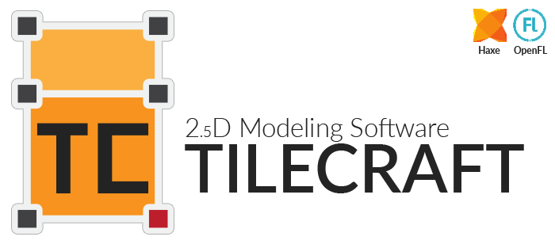

2.5D fast multi-platform modeling tool to make tiles for games, icons or whatever you want!

- Developed by [Simone Cingano](http://akifox.com)

- Based on [LGModeler](https://github.com/angryoctopus/lgmodeler) by [AngryOctupus](http://www.angryoctopus.co.nz/)

- Original idea from [lostgarden.com](http://www.lostgarden.com/2013/10/prototyping-challenge-3d-modeling-tool.html)

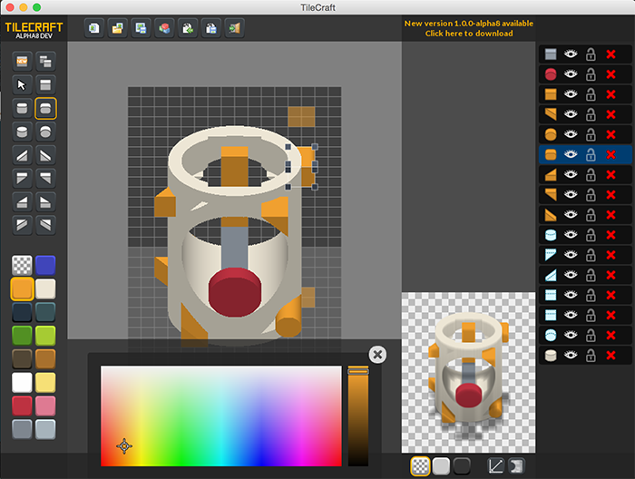


---
[Read the Quick guide to understand how to use TileCraft](GUIDE.md)
---

## Index

- [Status of the project](#status)
- [Milestones](#milestones)
- [Download](#download)
- [Build by the sources](#try-it)
- [Lostgarden challenge](#lostgarden-challenge)
- [Sample models](#examples)
- [TODOs](#todo)

## Status

The project is in an ALPHA development stage.

Anyway the BETA status is very close.

See the [TODOs](#todo) to check the work in progress.

## Milestones

 - **alpha:  Shape and model (load and save to Base64)**
 - **alpha2: Model renderer**
 - **alpha3: Lights renderer + postfx (Antialias+outline)**
 - **alpha4: Basic interface**
 - **alpha5: Save to PNG (image+model) and big housekeeping**
 - **alpha6: Shape list + improved gui**
 - **alpha7: Model editing**
 - **alpha8: Open/Save + check updates + improved feedbacks**
 - **alpha9: unreliable systools removed**
 - *beta stage: Improve interface and renderer* **<-- in progress**
 - *rc stage: Polish the app*
 - *release: Done!*

## Download

[For Linux (32), Mac and Windows](https://github.com/yupswing/TileCraft/releases/tag/v1.0.0-alpha.9)

## Try it

To compile the project by yourself you need to set up some stuff
[(see also this guide from Wulf)](https://github.com/Wulf/TileCraft/blob/master/README.md)

#### Haxelib

Install the needed libraries (and keep them updated)
```
haxelib install openfl
haxelib run openfl setup
haxelib install actuate
haxelib install akifox-transform
haxelib install akifox-asynchttp
haxelib install hxColorToolkit
haxelib install compiletime
haxelib install format
haxelib install systools
haxelib git plik https://github.com/yupswing/plik.git
```

(Only Windows or Mac) Rebuild systools for your platform (the project need to be revived!)
```
haxelib run lime rebuild systools [windows|mac]
```

Clone this repository
```
git clone https://github.com/yupswing/TileCraft.git
```

And finally try to compile and run (need to use legacy OpenFL)

**Note**: NEKO is very slow, I strongly recommend to run native instead
```
cd tilecraft
haxelib run lime test [windows|mac|linux] -Dv2 -Dlegacy
```

*Notes*: Sadly systools has lots of problems so I can't use the native Open and Save Dialogs right now

On Mac it works only the native save dialog (you have to put a path by hand if you want to open a model).

On Linux no native dialog works (you have to put a path by hand if you want to open a model).


## Lostgarden challenge

The original idea for this tool comes from [lostgarden.com](http://www.lostgarden.com/2013/10/prototyping-challenge-3d-modeling-tool.html)

Here's the test-cases he provides to check the efficiency of the tool.

This were made in just five 5 minutes (all of them!)

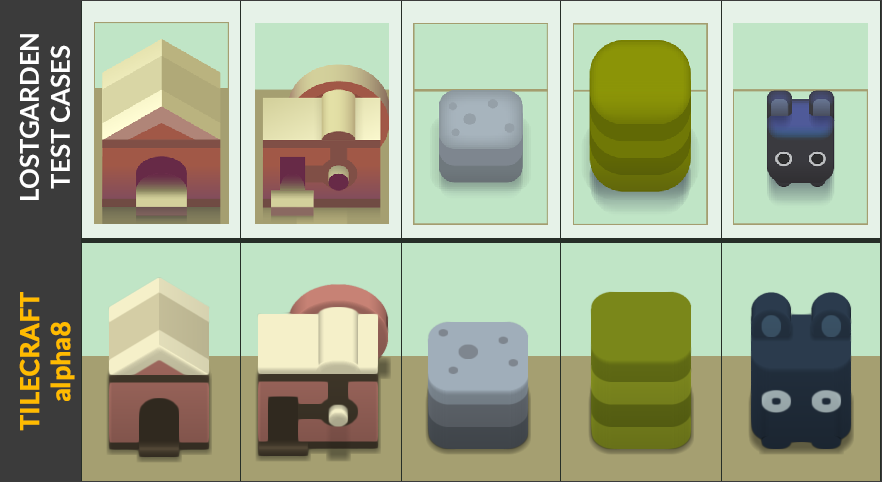

## Examples

Here some example models. To import them in TileCraft there are two ways:
- Click on  and after `CTRL`+`V` or `CMD`+`V` one of this example Base64 strings
- Otherwise you can download the PNG and load it in TileCraft (yes [it works!](GUIDE.md#export))

##### A complex shape
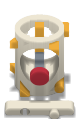

```
Ff__1fb_QEW78K8-7ebTJDI_OVJXUpAjpswzUUY1p3At____9-F2vjJB33qSfoaPprO8Mzw5DkBLCjwAWldvAGlIj1CrKhJwRZrNMEtIzmJFGhKCq5rNkiNnvCLNRc3CI0USAnhmP0xpzGlDEt4BDng7eEPe3gEDLd4BQEXeAUOr7wFCvHkS
```

##### A truck
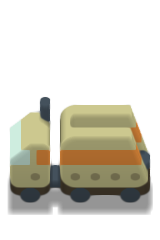

```
Ff__1fb_QEW7PqXyzu3fRFFcFRoMnpdtzMiPUUY1p3At6pA-9-F2vjJB1d7WfoaPprO8GG6LIxgUiyMnbos5BB6aIkQjqxInFIs4RM2rEkR4qxIDEotnGj6LZ3ASi3iA3os5EH-aWTREiGoAVYs4RnerREaZq0RGu6tERt2rREYzq0Q03ppE
```

##### A car
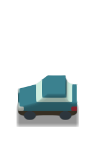

```
Df__1fb_QEW7PqXyzu3fRFFcFRoMO4GPzMiPUUY1p3At6pA-9-F2vjJB1d7WfoaPprO8GDyLI0RFqxImPIs2RKurEgNWi1UDfItVLMy7My0ziDMtM7szQL2LWHBni1YANYtWcDV7RA..
```

##### An happy farm ;)
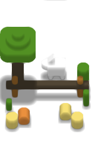

```
E____wAA____PqXys9vuJDI_OVJXUpAjpswzUUY1p3At6pA-9-F2vjJB33qSfoaPprO8OxK8AUo0qwFLq5oBO828ATgjNBg5IlUDOd1VAwgeVSIBigESMXoBIjGIAQExqgEBUYgAMzYRiAE2FCWbNiM0vBYFFpo27ncCNt40BA..
```

##### A fancy home
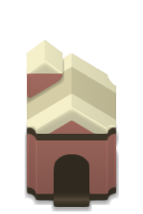

```
Ev__1fb_QEW7PqXys9vuJDI_OVJXUpAjpswzUUY1x4J11M2l9fDJvjJB33qSfoaPprO8WzRo72tWaO9rjG2tWzdtrQk8bQgAaY0UQGl9Nghp3gAIPE0AWjeLrVk3TYtqjIutaYy9iwg8bZkwI94LMM3eCzDNVgsZNmh9
```

##### A dice
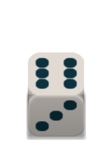

```
C___1fb_4NrTPqXyDDJAJDI_OVJXUpAjpswzUUY1p3At6pA-9-F2vjJB33qSfoaPprO8EUspByFLKQczVjRnM5o0ZzOaeGdDVokSM1Z4Z0OaiVYzVlZnM5pWZ0N4iTQ.
```

##### HOME (lostgarden test-case)
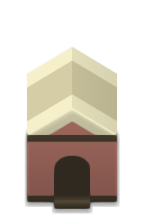

```
DP__1fb_QEW7PqXys9vuJDI_OVJXUpAjpswzUUY1x4J11M2l9fDJvjJB33qSfoaPprO8a4xdrVs3Xa0JPE0IAGmNFEBpfTYIad4ACDxNAFo3e61ZN02Laox7rWmMTYsIPF2Z
```

##### FACTORY (lostgarden test-case)
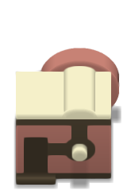

```
DP__1fb_QEW7PqXys9vuJDI_OVJXUpAjpswzUUY1x4J11M2l9fDJvjJB33qSpmxRprO8CS1tCAA1jRYIJt4ACC1NAAgtfZlLmt5FSIvNNkleIwlLi32rCy19qghpzUUIms1Z
```

##### STONE (lostgarden test-case)
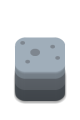

```
CP__1fb_QEW7PqXys9vuJDI_OVJXUpAjpswzUUY1p3At6pA-9-F2vjJBY2tzfoaPoK66HTwqAh48KjUfPCpnPkQzZz6qRGc-u3dnPlWIZz5nVmc.
```

##### TREE (lostgarden test-case)
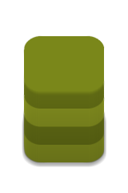

```
BP__1fb_QEW7PqXys9vuJDI_OVJXUpAjpswzUUY1p3At6pA-9-F2vjJBorAneocaoK66HTwqAh48KjUePCqbHTwqaA..
```

##### WOODCHUCK (lostgarden test-case)
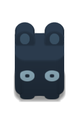

```
DP__1fb_QEW7SGV9s9vuKztNOVJXUpAjpswzUUY1p3At6pA-9-F2vjJBorAneocaoK66FDwqGkRGmgFEm5oBQ0aaV0ObmldEVZpmRKqaZkQ2Vq5EnFauQqtWvUJFVr0ADwMK
```

# TODO

The tag in bold, before every entry, indicates at what stage that feature will be, hopefully, implemented.

 - General
  - [x] Check online for updates
  - [ ] **BETA** Housekeeping (make the whole more coherent)
  - [ ] **RC** Unified dispatcher
  - [ ] **RC** Online repository
  - [ ] **RC** Make sure everything got disposed/destroyed
  - [ ] **RC** Make sure every listener got removed
  - [ ] **RC** Look and fix every TODO in the code
  - [ ] **POST RELEASE** Support OpenFL3
 - Conversion of Java code to Haxe code
  - [x] Internal Model
  - [x] I/O + Base64 encoder/decoder *(improved in alpha4)*
  - [x] Renderer (Fast+Lights)
  - [x] GUInterface *(improved in alpha6)*
  - [x] Model wysiwyg editor
 - Renderer
  - [x] Convert LGModeler Renderer
  - [x] Output different size ( 0.5 , 0.25 , 0.125 )
  - [x] Fix incorrect rendering (ordering slices)
  - [x] POSTFX shaders (apply FXAA to have smooth output image)
  - [x] POSTFX make FXAA support alpha channel
  - [x] POSTFX Use normal scaling with no PostFx if opengl not supported
  - [x] Sync between renderers delays
  - [ ] **BETA** Support edge smoothing
  - [ ] **BETA** batch renderer and save to file
  - [ ] **BETA** Trick NORM to have N/E Ramps and rounded N/S edges
 - Model
  - [x] Convert LGModeler Model
  - [x] Support for PNG Output with embedded model data
  - [ ] **BETA** Add author and model name to PNG metadata
  - [ ] **BETA** Save enabled and lock to model data (tcMa)
  - [ ] **BETA** Permit change color0 and use it  as floor color (rendered)
  - [ ] **BETA** Add more primitives (Prism, Arc)
  - [ ] **BETA** Extend to 64 shapes
  - [ ] **RC** Extend model to 32 colors (use the other 16 as replacement for batch rendering)
 - Interface
  - [x] Resizable window
  - [x] ShapeList dragging to reorder shapes in model
  - [x] Add shape to model
  - [x] Clone shape
  - [x] I/O from string (Base64)
  - [x] Feedback on Load/Save/Boot/Errors
  - [x] Save/Load file
    - Windows: Save and load native dialogs
    - Mac: Save native + load textual (problems with systools)
    - Linux: Save and load textual (problems with systools)
  - [ ] **BETA**History (basic keep last 5 models as steps)
  - [ ] **BETA** Report waiting (render especially) with Thread (and GUI modal 'box')
  - [ ] **BETA** Minimap (Orthogonal Top and Side view)
  - [ ] **BETA** ALT (center transformation), SHIFT (keep it square), Rotation (single element, whole context)
  - [ ] **BETA** 90deg rotations (xyz) (changing positions and primitive type to simulate rotation)
  - [ ] **RC** Support light style scheme


  ## Utilities

  ### Conversion regexp from java to haxe

  ```
  (public|private) (static )?([a-z]+)([^{;]+\([^{]+)
  $1 $2function$4:$3
  ```
  ```
  (int|byte|float|boolean)\[\] ([a-z0-9]+)
  $2:Array<$1>
  ```
  ```
  (int|byte|float|boolean) ([a-z0-9]+)
  $2:$1
  ```
  ```
  \(Int\)
  Std.int
  ```
